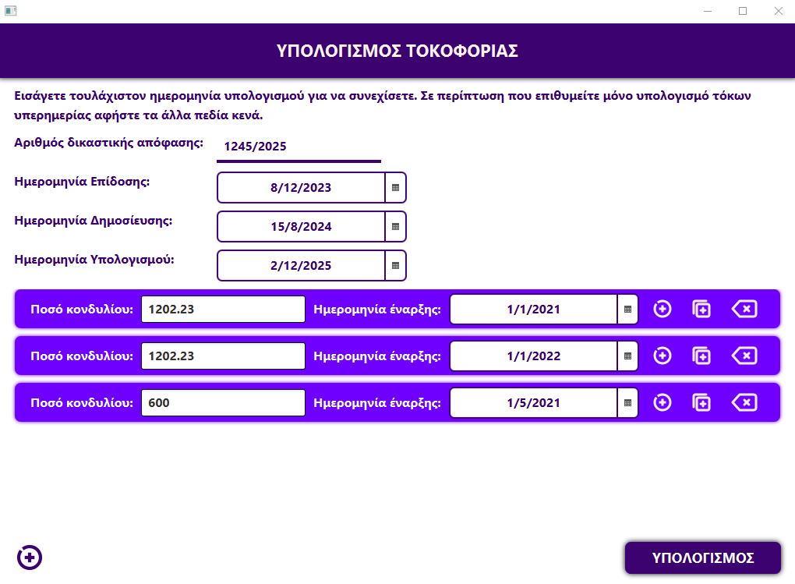

# Interest Calculator

Μία εφαρμογή που υπολογίζει τόκους υπερημερίας και επιδικίας επί των κεφαλαίων που επιδικάζονται με δικαστική απόφαση. Η εφαρμογή απευθύνεται σε δικηγόρους (και όχι μόνο) που επιθυμούν να συντάξουν ευκολότερα επιταγές προς πληρωμή. Συνήθως οι γνωστές εφαρμογές της NOMOS, των εκδόσεων Σάκκουλα και των διάφορων ΔΣ παρέχουν τη δυνατότητα για υπολογισμό ενός κεφαλαίου κάθε φορά. Τι γίνεται όμως όταν μία απόφαση επιδικάζει 20 π.χ. διαφορετικά κονδύλια, με διαφορετικές ημερομηνίες έναρξης τοκοφορίας το καθένα; Η εφαρμογή Interest Calculator προσπαθεί να λύσει αυτό το πρόβλημα, εισάγοντας την ημερομηνία υπολογισμού, την ημερομηνία έναρξης τόκων επιδικίας +2 μονάδων (ημερομηνία επίδοσης της αγωγής), και την ημερομηνία δημοσίευσης της απόφασης (έναρξη τόκων επιδικίας +3, εφόσον δεν ασκήθηκαν ένδικα μέσα). Μετά ο χρήστης εισάγει το κάθε κονδύλιο ξεχωριστά, δηλώνοντας ως ημερομηνία έναρξης τοκοφορίας την πρώτη ημέρα που η απαίτηση κατέστη ληξιπρόθεσμη (π.χ. εάν η απόφαση αναγράφει ως έναρξη τοκοφορίας την 01η/01/2022, ο χρήστης θα βάλει ακριβώς αυτήν την ημερομηνία, όχι την 31/12/2021, όπως γίνεται π.χ. στη NOMOS). Μετά θα πατήσει το κουμπί υπολογισμός και εάν όλα τα στοιχεία δηλώθηκαν όπως πρέπει θα εμφανιστεί ένα παράθυρο όπου μπορεί να επιλέξει το που θα αποθηκεύσει το αρχείο word που δημιουργήθηκε. Το αρχείο αυτό περιέχει έναν πίνακα που αναγράφει αναλυτικά το κάθε κεφάλαιο, τους τόκους και το σύνολο. Εάν έχετε πατήσει το κουμπί υπολογισμός και δεν εμφανίζεται τίποτα, δύο τινά υπάρχουν, είτε δεν έχετε βάλει τα στοιχεία σωστά, είτε υπάρχει πρόβλημα στον κώδικα.

Η εφαρμογή αυτή θα παραμείνει ανοικτού κώδικα. Για απορίες, ιδέες και προτάσεις επικοινωνία μέσω email: djames.gr@gmail.com

## Οδηγίες λήψης

!Προς το παρόν μόνο για Windows!

Αριστερά στο μενού Releases επιλέγετε την τλευταία έκδοση και στη συνέχεια επιλέγετε το αρχείο εγκατάστασης msi, το οποίο μετά θα εκτελέσετε ως πρόγραμμα και θα εγκαταστήσει αυτόματα την εφαρμογή στον υπολογιστή. Υπάρχει και ο σύνδεσμος: https://github.com/dimitrisDlt/InterestCalculator/releases/download/v1.0.0/InterestCalculator-1.0.msi.

Εάν θελήσετε να απεγκαταστήσετε το πρόγραμμα, μπορείτε να το κάνετε από τις ρυθμίσεις ή να εκτελέσετε ξανά το αρχείο msi και να επιλέξετε remove.

## Επικείμενες αλλαγές

1) Αφαίρεση τόκων επιδικίας για τα διαστήματα αναστολής λόγω covid.
2) Καλύτερη εμφάνιση.
3) Μηνύματα λάθους όταν εισάγονται λανθασμένα στοιχεία.
